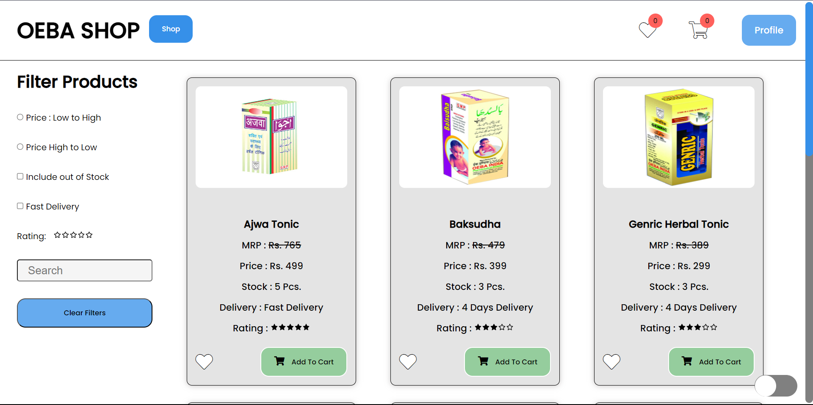

# VedicShop : An Ecommerce webApp
An Ecommerce webapp having pages product-page, cart and wishlist page. This app has functinality of dark mode.

## Live Link
Access this [webApp](https://oebashop.netlify.app)

## Table of Context:

-[About the App](#about-the-app)

-[Screentshot](#screenshot)

-[Technologies](#technologies)

-[Setup](#setup)

-[Status](#status)

## About the App
It is an ecommerce webApp made with the help of HTML, CSS, JS, React, React-Router and some APIs. Its purpose was to extensively understand the use of useReducer + useContext as a state management. It is SPA made with react-router to perform client-side routing. This app also has a functinality of dark mode.

## Screenshot

## Technologies
HTML, CSS, JS, React, React Router & `Icones` for the icons

## Setup
- download or clone the repository
- run `npm install`

## Status
Completed
